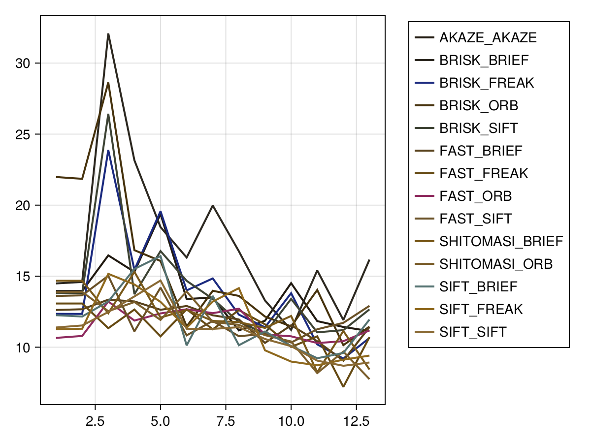

# Final Project Writeup

## FP.1 Match 3D Objects

The function `matchingBoundingBoxes` in the file `camFusion_Student.cpp` is
implemented as described in the rubric.

## FP.2 Compute Lidar-based TTC

The function `computeTTCLidar` in the file `camFusion_Student.cpp` implements
the TTC computation based purely on lidar data as described in the exercises. To
prevent outlier points leading to wrong results, median and standard deviation
of the `x` coordinate are computed and only points within a given distance from
the median are considered for the computation.

## FP.3 Associate Keypoint Correspondence with Bounding

The function `clusterKptMatchesWithROI` in the file `camFusion_Student.cpp`
computes the keypoint matches for a given box as described in the rubric. To
handle outliers median and standard deviation of the euclidian distance between
two points are computed and only matches within a distance given as a multiple
of the standard deviation from the median are considered. The tests shows that
this factor needs to be fairly small for good results. Currently I set it to
`0.5` for the `FAST/BRIEF` algorithm.

## FP.4 Performance Evaluation 1

The following is the output of the TTC system, where the keypoint/descriptor
algorithm pair is FAST/BRIEF.

```
TTC Lidar : 12.972159 s, TTC Camera : 11.750239 s
TTC Lidar : 12.972159 s, TTC Camera : 11.694809 s
TTC Lidar : 13.246532 s, TTC Camera : 13.443180 s
> TTC Lidar : 29.057666 s, TTC Camera : 13.265749 s
TTC Lidar : 9.343759 s, TTC Camera : 12.598070 s
> TTC Lidar : 18.031756 s, TTC Camera : 12.584364 s
TTC Lidar : 14.987674 s, TTC Camera : 11.743797 s
TTC Lidar : 10.099996 s, TTC Camera : 11.360505 s
TTC Lidar : 10.967763 s, TTC Camera : 9.929307 s
TTC Lidar : 8.094218 s, TTC Camera : 11.406610 s
TTC Lidar : 8.813924 s, TTC Camera : 10.713727 s
TTC Lidar : 10.292551 s, TTC Camera : 10.484987 s
TTC Lidar : 8.309779 s, TTC Camera : 11.081470 s
```

The two lines marked with `>` show a significant difference of the TTC computed
purely with lidar to the TTC computed with the camera. Looking at the topview of
the lidar points of the preceding vehicle we can make the following observations:
  
  > The TTC expected from manually looking at the topview is a lot smaller.
  > The distance to the preceding vehicle strictly decreases.
  > there seem to be outliers visible at the very bottom of the bounding boxes.

By allowing only points within a smaller distance to the median (1 * standard
deviation), the results improve significantly:

```
TTC Lidar : 13.945691 s, TTC Camera : 11.750239 s
TTC Lidar : 13.945691 s, TTC Camera : 11.694809 s
> TTC Lidar : 16.463854 s, TTC Camera : 13.443180 s
TTC Lidar : 12.459043 s, TTC Camera : 13.265749 s
> TTC Lidar : 13.233407 s, TTC Camera : 12.598070 s
TTC Lidar : 13.282201 s, TTC Camera : 12.584364 s
TTC Lidar : 11.343067 s, TTC Camera : 11.743797 s
TTC Lidar : 9.863465 s, TTC Camera : 11.360505 s
TTC Lidar : 11.541973 s, TTC Camera : 9.929307 s
TTC Lidar : 8.419037 s, TTC Camera : 11.406610 s
TTC Lidar : 9.587677 s, TTC Camera : 10.713727 s
TTC Lidar : 9.620830 s, TTC Camera : 10.484987 s
TTC Lidar : 7.683126 s, TTC Camera : 11.081470 s
```
The reason for the outliers in the point cloud could be manifold. The source
of the faulty lidar point could for example be dust/insect in the air or even
a waterdrop. It's noteworthy that setting a more agressiv filter gives better
results.

However, the lines marked with `>` are still quiet far off of the TTC expected
from looking manually at the topview of the lidar point cloud. The explanation
for this is the fact that both vehicles are decelerating during these frames
(stop lights and the vehicles brake lights can be seen in the scene). Our TTC
computation however relies on a linear model and only takes into account the
relative speed of the vehicles. The nonlinear model taking into account the
different accelerations of the vehicles would lead to better results.

# FP.6 Performance Evaluation 2

The results of the different keypoint/descriptor algorithms can be found in this
[table](./ttc_camera.html). Algorithms that performed best were those that used
the `FAST` keypoint detector. `SIFT/SIFT` also had reasonably good performance.
One should consider though that the hyperparameters were not optimized for
all but `FAST`. The `HARRIS` keypoint detector was among the algorithms that
performed poorest.

The following figure gives a comparision between the result.



Algorithms that could not assign a TTC to all frames have been omitted for
clarity. The plot shows that several keypoint/descriptor pairs struggle with
the same frame in the beginning and assign a TTC that is way too big. This can
be due to a high number of mismatched descriptor pairs that yield outliers in
the distance ratios and/or a small number of detected keypoints on the preceding
vehicle. Interestingly, several keypoint/descriptor algorithm seem to be
troubled with the same frames. A possible explanation might be the lightning,
reflection and shade distribution in those frames, that lead to few keypoints or
bad matches.
